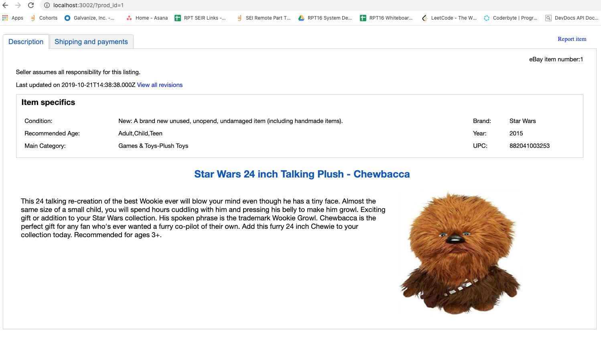
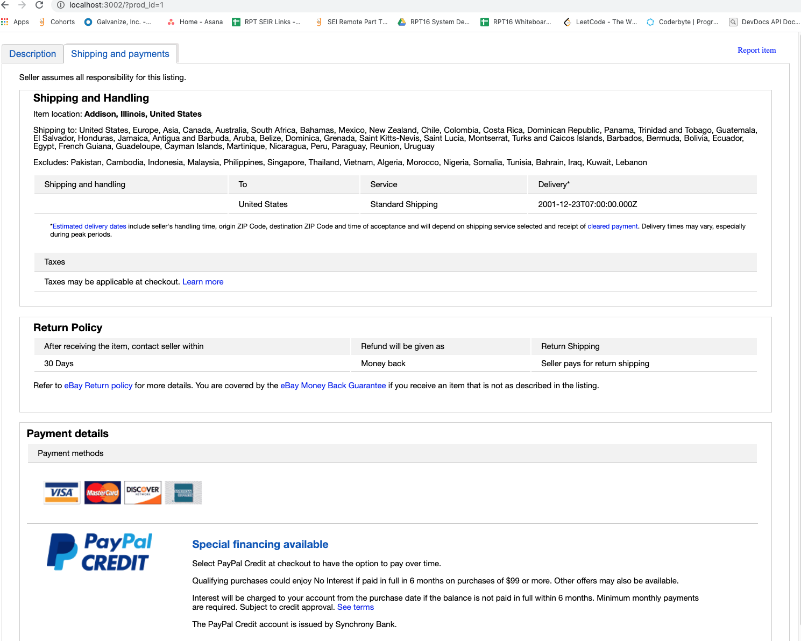
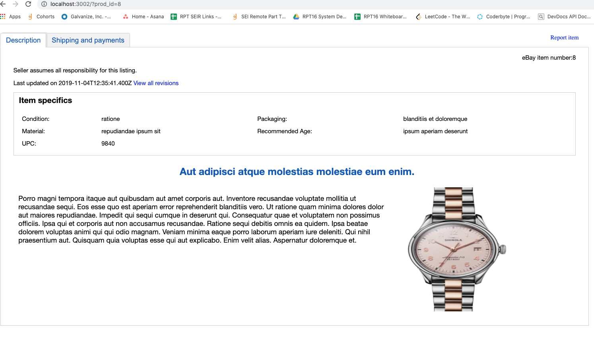
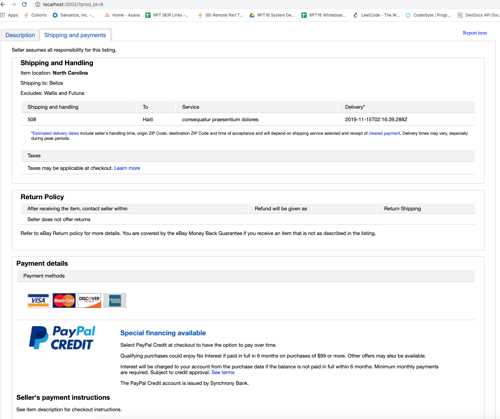

# Ebay Item Clone: Product Description and Shipping Info
> One of 4 microservices that combine in a reverse proxy to create a clone of a product page on eBay.

## Repos for the other 3 microservices and Reverse Proxy
  - https://github.com/rpt16Quarks/Service_Matt
  - https://github.com/rpt16Quarks/alexFEC
  - https://github.com/rpt16Quarks/ratings_and_reviews_service
  - https://github.com/rpt16Quarks/proxy_troy


## Table of Contents
1. [General information](#general-information)
1. [Technologies](#technologies)
1. [Requirements](#requirements)
1. [Images](#images)
1. [Features](#features)
1. [Development](#development)
1. [Installing Dependencies](#installing-dependencies)

## General Information
> This repo is for the product description and shipping information section of an item page for an eBay clone website. This service is a full stack application, that can be combined with others in a reverse proxy to create a completed clone page. Emphasis was put on front end technologies with a light weight server and data set.

 > I built this application with two goals in mind. The first was to get a better understanding of how all of the systems work together in full stack development, and then take those systems from a dev environment to deployment. The second was to learn how Micro Services would be combined in the real world and the types of challenges that must be overcome to make several micro services render correctly with matching item data.

## Technologies
Application was created with:
* Javascript
* React
* Styled Components
* Webpack
* Grunt
* Express
* Mongodb
* Mongoose

Was deployed on AWS with:
* AWS EC2
* AWS S3 bucket for images
* Docker

Testing Suite:
* Jest
* Enzyme

## Requirements
An `nvmrc` file is included  [nvm](https://github.com/creationix/nvm).
- Node 6.13.0
- Local install of Mongodb

## Images





## Features
* App utilized query params to sync product information with other micro service
* Grunt adds Javascript bundle to AWS S3 bucket
* Set up to run on Docker, either a continer with only the server and client, or with docker-compose for running with a mongodb container.
* Jest test suite for testing React components and server routes
* After considering the trade offs, used Styled Components for ease of readability in the React code, and to apply styles based on state


## Development
> Minor things that I would like to come back and work on:

* Refactor the server to rely on environment variables
* Reconfigure webpack to create a development bundle and a production bundle
* Create a wait-for-it script for the docker compose file

> Major things that I would like to come back and work on:
* Restyle the layout with MaterialUI and make it Responsive
* Refactor components to use React Hooks
* Refactor test suite to work with React Hooks, add more test coverage

### Installing Dependencies
From within the root directory:

```sh
npm install
npm run seed
```
Add the query parameter prod_id set to an product number (prod_id=1), in the URL to get app to render
